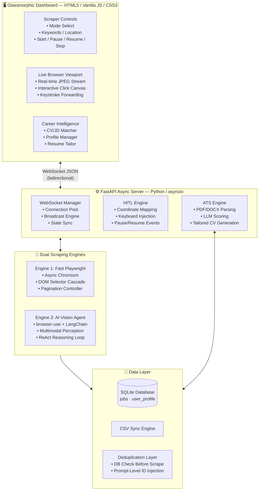
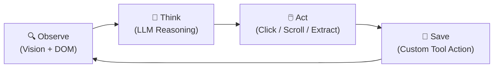
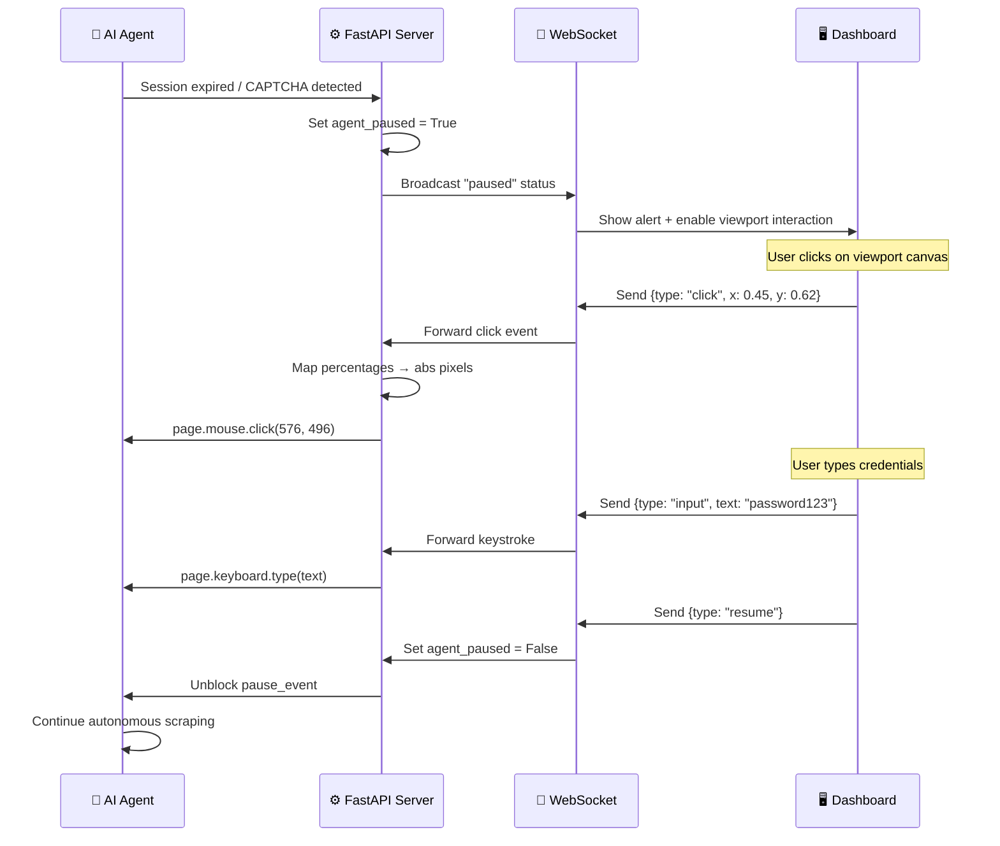
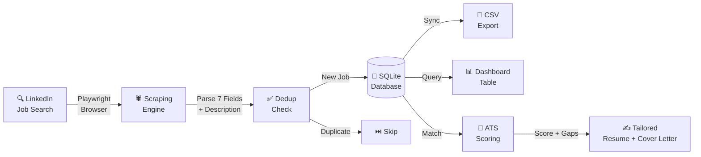

<div align="center">

# 🚀 FindMeJobs.ai

### Autonomous AI Job Discovery & Career Intelligence Agent

*An agentic AI system that navigates LinkedIn like a human, harvests job listings autonomously, and evaluates how well your resume matches — all from a single glassmorphic dashboard.*

[](https://python.org)
[](https://fastapi.tiangolo.com)
[](https://playwright.dev)
[](https://langchain.com)
[](https://ai.google.dev)

---

[Features](#-features) · [Architecture](#-system-architecture) · [Quick Start](#-quick-start) · [How It Works](#-how-it-works) · [Tech Stack](#-tech-stack)

<br/><br/>


</div>

---

## 💡 The Problem

Job hunting is broken.

Every day, millions of professionals spend hours manually browsing LinkedIn — scrolling through search results, clicking individual listings, copying descriptions into spreadsheets, and trying to figure out if they're even qualified. It's repetitive, time-consuming, and mentally draining.

**What if an AI agent could do all of that for you?**

Not a simple script that breaks when a class name changes. Not a Chrome extension with limited access. A **real autonomous agent** that sees the browser like you do, clicks through pages like you would, handles login challenges when they appear, and delivers structured, deduplicated data to a beautiful dashboard — while you focus on what actually matters: preparing for interviews.

---

## ✨ The Solution: FindMeJobs.ai

FindMeJobs.ai is an **end-to-end agentic AI platform** that automates the entire job discovery pipeline:

```
🔍 Search → 🤖 Scrape → 📊 Organize → 📝 Evaluate → ✍️ Tailor
```

It combines a **dual-engine scraping architecture** (deterministic speed + AI intelligence), a **real-time Human-in-the-Loop control layer**, and an **LLM-powered career intelligence engine** — all served through a premium dark glassmorphic web dashboard.

---

## 🏗 System Architecture



---

## 🌟 Features

### 🤖 1. Dual-Engine Agentic Scraping

FindMeJobs.ai offers **two scraping modes** that you can switch between from the dashboard:

| Mode | How It Works | Best For |
|:---|:---|:---|
| **⚡ Fast Playwright** | Custom async Chromium crawler with multi-tier DOM selector fallbacks. Scrolls search results, clicks each card, parses 7 structured fields per job. No API key needed. | Speed — scrapes jobs in **<5 seconds each** |
| **🧠 AI Vision Agent** | Autonomous `browser-use` agent powered by **Gemini 2.5 Flash** or **GPT-4o-mini** via LangChain. Sees the browser visually, reasons about what to click, and uses custom tool actions to save data. | Resilience — handles **dynamic layouts and edge cases** |

The AI Agent uses the **ReAct pattern** (Reason → Act → Observe) — the same architecture behind OpenAI Operator and Google Project Mariner:



### 🕹️ 2. Real-Time Human-in-the-Loop (HITL) Control

When the AI encounters a login wall, CAPTCHA, or 2FA challenge, it doesn't crash — it **pauses and asks you for help**.



**Key HITL capabilities:**
- 📸 **Live JPEG streaming** — Browser screenshots pushed via WebSocket every 1.5 seconds
- 🖱️ **Interactive click canvas** — Click anywhere on the viewport image; coordinates are normalized and mapped to exact browser pixels
- ⌨️ **Remote keystroke injection** — Type directly into the browser's focused element from the dashboard
- ⏸️ **Auto-pause on session expiry** — Agent detects authentication failures and pauses automatically

---

### 🎯 3. Intelligent Deduplication

Before scraping any job, the system checks SQLite for existing records. But it goes further:

```python
# Existing job IDs are injected directly into the AI agent's system prompt
existing_ids_str = ", ".join(get_existing_job_ids())

task_prompt = (
    f"... scrape jobs from LinkedIn ...\n\n"
    f"IMPORTANT: The following job IDs have ALREADY been scraped: "
    f"[{existing_ids_str}]. Do NOT click on or scrape these job IDs."
)
```

This **prompt-level deduplication** prevents the LLM from even clicking on already-scraped cards — saving tokens, network calls, and execution time.

---

### 📝 4. AI Career Intelligence Engine

Beyond scraping, FindMeJobs.ai acts as your **AI career copilot**:

| Feature | What It Does |
|:---|:---|
| **📄 CV Upload & Parsing** | Upload PDF or DOCX resumes. Text is extracted via PyMuPDF / python-docx and structured into a normalized profile schema. |
| **🎯 ATS Suitability Scoring** | LLM compares your profile against any scraped job description. Returns a **0–100 match score**, matched skills, missing skills, and actionable tips. |
| **✍️ Tailored Resume Generator** | Auto-generates a **job-specific Markdown resume** that emphasizes your relevant experience and skills for that particular listing. |
| **💌 Cover Letter Writer** | Produces a professional cover letter using the **AIDA copywriting framework** (Attention → Interest → Desire → Action), connecting your profile to the job's requirements. |
| **👤 Profile Manager** | CRUD interface for managing your master profile — experience, projects, skills, certifications, and education — stored in SQLite. |
| **🤖 LLM Profile Import** | Paste raw resume text and let the LLM auto-parse it into structured profile sections. |

---

### 📊 5. Premium Glassmorphic Dashboard

A responsive split-panel web interface built with Vanilla HTML5, CSS3, and JavaScript:

| Component | Description |
|:---|:---|
| **Sidebar Navigation** | Vertical tab bar with 3 modules — Scraper, CV Matcher, My Profile |
| **Scraper Controls** | Mode selector, keyword/location inputs, LLM provider config, Start/Pause/Resume/Stop buttons |
| **Jobs Database Table** | Searchable, sortable data grid with quick date filters (All / Today / Yesterday) and an advanced Filter & Sort modal |
| **Live Viewport** | Real-time browser view with interactive click/type capabilities and a Browser/Terminal tab switcher |
| **Terminal Logs** | Streaming execution logs with timestamps, agent thoughts, and HITL events |

**Design System:**
- 🎨 Dark gradient background (`#090a0f → #121420`)
- 🪟 Glassmorphism cards with `backdrop-filter: blur(12px)`
- ✏️ Typography: Outfit (headings), Inter (body), JetBrains Mono (code/logs)
- ✨ Animated status indicators with glow pulse effects
- 🎯 Custom-styled scrollbars and form inputs

---

## ⚡ Quick Start

> **Prerequisites:** [Python 3.10+](https://www.python.org/downloads/) and [Git](https://git-scm.com/downloads)

### Option A: One-Click Scripts

**Windows:**
```powershell
git clone <repository-url>
cd find-me-jobs-ai
setup.bat           # Creates venv, installs dependencies + Playwright (~2-3 min)
start.bat           # Launches server + opens browser automatically
```

**macOS / Linux:**
```bash
git clone <repository-url>
cd find-me-jobs-ai
chmod +x setup.sh start.sh
./setup.sh          # Creates venv, installs dependencies + Playwright (~2-3 min)
./start.sh          # Launches server + opens browser automatically
```

### Option B: Manual Setup

```bash
# 1. Create virtual environment
python -m venv .venv

# Windows:
.\.venv\Scripts\activate
# macOS/Linux:
source .venv/bin/activate

# 2. Install dependencies
pip install -r requirements.txt
playwright install chromium

# 3. Initial LinkedIn login (one-time)
python scrape_linkedin.py
# → Log in manually in the browser window that opens
# → Press Enter in terminal after you see your LinkedIn feed

# 4. Launch the dashboard
python -m uvicorn app:app --host 127.0.0.1 --port 8000
```

Then open **http://127.0.0.1:8000** in your browser.

---

## 🔐 LinkedIn Authentication

The scraper requires a logged-in LinkedIn session. There are two ways to authenticate:

### Method 1: Pre-Login Script *(Recommended for first setup)*

```bash
python scrape_linkedin.py
```

A headed Chrome window opens. Log in with your credentials, complete any 2FA, and once you see your feed — press **Enter** in the terminal. Session cookies are saved to `.playwright_data/` and reused automatically.

### Method 2: HITL Login *(During scraping)*

1. Start scraping from the dashboard
2. If not authenticated, the terminal shows `[HITL] LinkedIn session is not logged in`
3. The viewport enters interactive mode — click and type directly to log in
4. Click **Resume** to continue scraping

> ⚠️ Session data (`.playwright_data/`) is local and personal. Never commit or share it.

---

## 🔧 How It Works

### Data Flow



### Extracted Fields Per Job

| Field | Source | Fallback Strategy |
|:---|:---|:---|
| **Title** | `h1` → `.job-title` → `h2` | 8 selector tiers |
| **Company** | `.company-name a` → `a[href*='/company/']` | 8 selector tiers |
| **Location** | `.tertiary-description .tvm__text` | Filtered by exclusion keywords |
| **Work Mode** | Preference buttons → workplace type → location text parsing | Remote / Hybrid / On-site detection |
| **Date Posted** | `.tvm__text` containing "ago" / "posted" | 3 container fallbacks |
| **Salary** | Insight elements containing `$` / `yr` / `hr` | Bullet text fallback |
| **Employment Type** | Preference buttons → insight elements | Full-time, Part-time, Contract, Internship |
| **Description** | `.jobs-description__content` → `#job-details` | 4 selector tiers |

---

## 🛠 Tech Stack

| Layer | Technologies |
|:---|:---|
| **Backend** | Python 3.10+, FastAPI, asyncio, Uvicorn, WebSockets |
| **Scraper Engines** | Playwright (async), browser-use, LangChain |
| **LLM Providers** | Google Gemini 2.5 Flash, OpenAI GPT-4o-mini |
| **Document Parsing** | PyMuPDF (PDF), python-docx (DOCX) |
| **Data & Parsing** | SQLite3, CSV, BeautifulSoup4, lxml, Markdownify |
| **Frontend** | HTML5, CSS3 (Glassmorphism), Vanilla JavaScript, WebSocket API |
| **Fonts** | Outfit, Inter, JetBrains Mono (Google Fonts) |

---

## 📂 Project Structure

```
find-me-jobs-ai/
├── app.py                   # FastAPI server: WebSocket handler, scraping engines,
│                            #   HITL controller, ATS matcher, CV parser, profile CRUD
├── scrape_linkedin.py       # Standalone Playwright scraper with headed login flow
├── templates/
│   └── index.html           # 3,200-line glassmorphic dashboard (controls, viewport,
│                            #   CV matcher, profile manager, jobs table, modals)
├── requirements.txt         # 34 pinned Python dependencies
├── setup.bat / setup.sh     # One-click environment setup scripts
├── start.bat / start.sh     # One-click server launch scripts
├── jobs.db                  # SQLite database (jobs + user_profile tables)
├── jobs.csv                 # Auto-synced CSV export
├── .playwright_data/        # Persistent Chromium browser profile (session cookies)
└── .gitignore               # Excludes .venv, .playwright_data, jobs.db, jobs.csv
```

---

## 🤝 Contributing

Contributions are welcome! Follow the branching strategy:

```bash
# 1. Branch off development
git checkout development
git pull origin development
git checkout -b feature/your-feature-name

# 2. Use Conventional Commits
git commit -m "feat(scraper): add retry logic for rate-limited pages"

# 3. Merge back to development
git checkout development
git merge feature/your-feature-name
```

> Never commit directly to `main`. The `development` branch is merged to `main` only for stable releases.

---

## 📜 License

This project is for **educational and personal use**. LinkedIn's Terms of Service apply — use responsibly with your own authenticated session.

---

<div align="center">

**Built with ❤️ and too many cups of coffee**

*If this project helped you, consider giving it a ⭐*

</div>
